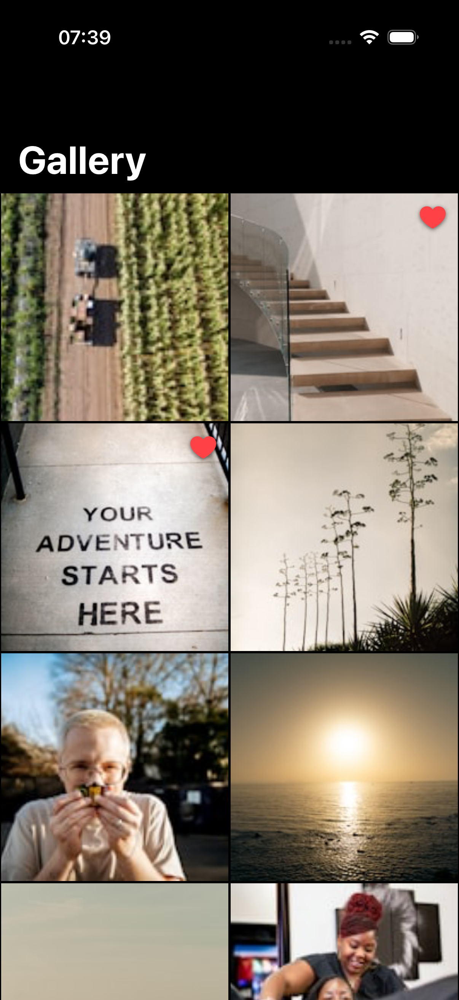
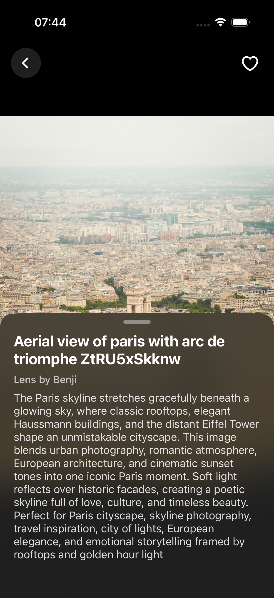

# Photo Gallery

An iOS image gallery app that fetches photos from the Unsplash API, displays them in an adaptive grid, and allows users to browse, view details, and mark images as favorites.

## Contact

**Nikita Harkavy**

- GitHub: [NikitaHarkavy](https://github.com/NikitaHarkavy)
- Email: HarkavyNikita@gmail.com
- Phone: +375 29 954-33-64
- Telegram: [@nikkkisha1](https://t.me/nikkkisha1)
- LinkedIn: [Nikita Harkavy](https://www.linkedin.com/in/nikita-harkavy-5b8040305)

## Overview

- Adaptive grid gallery with infinite scroll pagination (30 photos per page)
- Detail screen with full-size image, title, author, description, and a draggable bottom sheet
- Swipe navigation between photos via `UIPageViewController`
- Favorites with local persistence and visual indicators on thumbnails
- In-memory image caching (`NSCache`) for smooth scrolling
- Dark theme with blur effects

### Additional Features

- Interactive bottom sheet with peek/expanded states, pan gestures, and spring animations
- Custom blurred back button for an immersive detail view
- Adaptive grid columns calculated from screen width (works on all devices and orientations)
- Error state with retry button

## Architecture

**MVVM + Coordinator** — ViewModels handle business logic and state; the Coordinator manages navigation and dependency injection. No third-party dependencies.

| Technology | Usage |
|---|---|
| UIKit | Programmatic UI (no storyboards) |
| URLSession | Async/await networking |
| NSCache | Image caching |
| Core Data | Favorites persistence |
| Swift Testing | Unit tests |
| SwiftLint | Code style |

### SOLID

- **S** — each class has one responsibility (networking, persistence, image loading, etc.)
- **O** — `Endpoint` protocol is open for extension without modifying `APIClient`
- **L** — all dependencies use protocols, substitutable with mocks
- **I** — small focused protocols (1–2 methods each)
- **D** — ViewModels depend on abstractions; dependencies injected from `AppCoordinator`

## Screenshots

| Gallery | Detail (Collapsed) | Detail (Expanded) |
|---|---|---|
|  |  |  |

## Configuration

1. Register at [unsplash.com/developers](https://unsplash.com/developers) and get an **Access Key**
2. Copy `Secrets.example.xcconfig` to `Secrets.xcconfig` and paste your key:
   ```
   UNSPLASH_ACCESS_KEY = your_key_here
   ```
3. Open `Photo Gallery.xcodeproj` in Xcode and press **Run** (⌘R)

> `Secrets.xcconfig` is listed in `.gitignore` and will not be committed to the repository.

**Requirements:** iOS 15.6+ · Xcode 15+ · Swift 5.9+

**Tests:** ⌘U in Xcode (`FavoritesStoreTests`, `DetailViewModelTests`, `UnsplashPhotoTests`)
